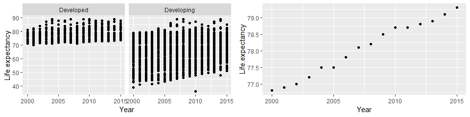
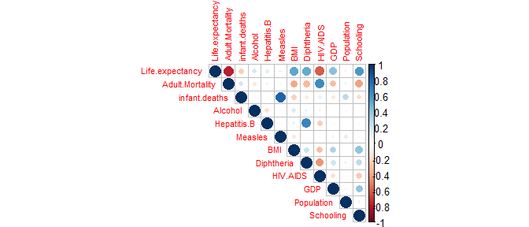
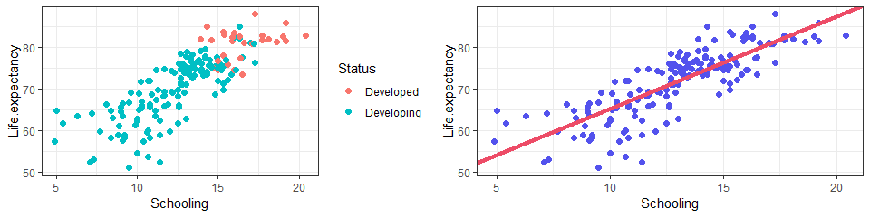
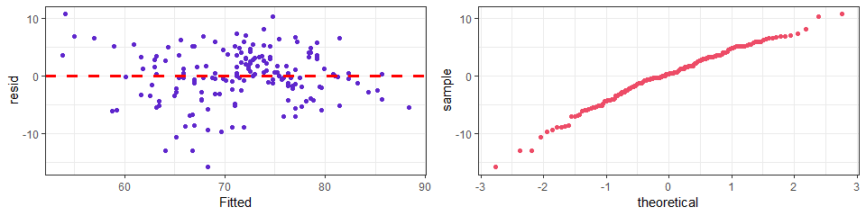
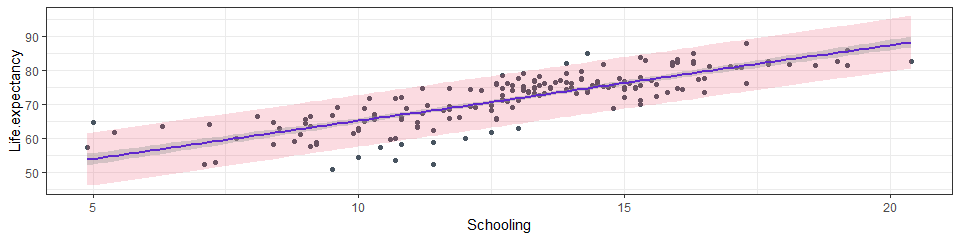

Does Schooling affect one’s Life expectancy?
================
Vaishnavi Rangarajan

## Introduction:

This report looks at the Life Expectancy dataset from Kaggle. We will
look at various explanatory plots, diagnostic plots, fit a linear model
to look at the relationship between the number of years of Schooling and
the Life Expectancy.  

#### **Question of Interest**

What is the relation between the mean of Life Expectancy in age and the
number of years of Schooling. We later use simple linear regression -
linear model to see how the mean Life Expectancy varies linearly with
the number of years of Schooling.

``` r
library(ggplot2)
```

    ## Registered S3 methods overwritten by 'ggplot2':
    ##   method         from 
    ##   [.quosures     rlang
    ##   c.quosures     rlang
    ##   print.quosures rlang

``` r
library(corrplot)
```

    ## Warning: package 'corrplot' was built under R version 3.6.3

    ## corrplot 0.84 loaded

``` r
library(RColorBrewer)
library(gridExtra)
```

    ## Warning: package 'gridExtra' was built under R version 3.6.3

#### **Summary of Dataset**

The Dataset chosen for this report is Life Expectancy dataset from
WHO.  

**Link**:
<https://www.kaggle.com/kumarajarshi/life-expectancy-who/data#>

The dataset contains life expectancy, health factors for 193 countries
collected from the World Health Organization (WHO) from year 2000-2015.
The dataset contains 22 columns and 2938 rows. We are interested in
variables that impact the Life Expectancy in a positive or negative way.

``` r
data <- read.csv("Life_Expectancy_Data.csv")
```

## Interesting facts about the data:

Let’s look at our data, We have Developed and Developing category which
might give us information on the spread of Life Expectancy data between
the two statuses of nations.

**Data Cleaning**: Let’s clean the data a bit, We have about 10
countries that have a **NA value** for Life Expectancy. All these 10
countries fall under the category of “Developing”. Let’s replace the NA
value with the mean value of the “Developing” group.

``` r
df<- data[!is.na(data$Life.expectancy),]
NA_mean<-mean(df$Life.expectancy[df$Status=="Developing"])
data$Life.expectancy[is.na(data$Life.expectancy)] <- NA_mean
```

``` r
plot1<-ggplot(data, aes(x= Year,y=Life.expectancy))+geom_point() +facet_wrap(~ Status)
plot3<- ggplot(data[data$Country == "United States of America",], aes(x= Year,y=Life.expectancy))+geom_point()
```

``` r
grid.arrange(plot1,plot3, nrow=1)
```

<!-- -->

We notice from this plot that the Developed Nations have a higher Life
Expectancy compared to the Developing nations on average and the
developing nations have a wider range of Life Expectancies. From the
plot on the right, We can see that the life expectancy for United States
of America is increasing linearly from the year 2000 to 2015. Do you
know? **Sierra Leone(Developing)** has the lowest life expectancy and
**Slovenia(Developed)** has the highest life expectancy.

``` r
data2015<- data[data$Year=="2015",]
```

#### **What do we see?**

``` r
sub_data<- data2015[,c(4,5,6,7,9,10,11,15,16,17,18,22)]

sub_data[is.na(sub_data)] <- 0
corrplot(type="upper",cor(sub_data), method="circle", tl.cex = 0.7) #Draw a correlation Plot
```

<!-- -->

We see the following observations from the correlation plot:

  - Life Expectancy and Adult Mortality have a negative correlation.
  - Life Expectancy and Schooling have a positive Correlation
  - Life Expectancy and HIV Deaths have a negative correlation
  - Number of reported measles cases and number of Infant deaths seem to
    have a positive correlation
  - Under five deaths and Infant deaths have a positive correlation

#### **What are we interested about?**

We are interested in the relation between the Schooling (Number of
years) to the Life Expectancy. When we perform a correlation test, we
get a value of 0.8181, which holds promises of a positive correlation.
Let’s investigate further.

## Method(Simple Linear Regression) :

Let’s plot a scatterplot of Schooling vs Life Expectancy. We will be
looking at the year of 2015. We see that the Life Expectancy increases
as the number of years in schooling increases. This indicaes a linear
relationship. Along with the high positive correlation value between the
Schooling and Life Expectancy, we can say that there is a clear linear
relationship between Life Expectancy and number of years of Schooling.  

**Null Hypothesis \(H_0 :\beta_1 = 0\)**  
**Alternative Hypothesis \(H_A: \beta_1 \neq 0\)**   The Null Hypothesis
would state that the slope is 0. i.e the relationship between Schooling
and Life Expectancy is not significant.  

``` r
data2015_set<- data2015[!is.na(data2015$Schooling),]
plotA<-ggplot(data = data2015_set, aes(x=Schooling, y=Life.expectancy)) +
  geom_point(aes(color = data2015_set$Status),size=2) +
  theme_bw() +
  labs(color = "Status")
```

We will be using a linear regression model assuming a linear
relationship between the mean of a Life Expectancy and Schooling(Number
of years). A model is fit for the mean **Life Expectancy** as a linear
function of **Schooling**:

``` r
mod1 <- lm(Life.expectancy ~ Schooling, data = data2015_set)
#summary(mod1)
```

\(\mu\)(LifeExpectancy|Schooling) = \(\beta_0 + \beta_1\) \* Schooling

``` r
bhat <- mod1$coef
plotB<-ggplot(data = data2015_set, aes(Schooling, Life.expectancy)) +
  geom_point(size =2, color ="#5352ed") + 
  theme_linedraw() +
  geom_abline(slope = bhat[2], intercept = bhat[1], colour='#ED4C67', lwd=1.5)+
  theme_bw()
```

``` r
grid.arrange(plotA,plotB, nrow=1)
```

<!-- -->

``` r
data2015_set$resid <- mod1$resid

plotC<-ggplot(data = data2015_set, aes(mod1$fit, resid)) + 
  geom_point(color="#5f27cd") + 
  theme_linedraw() +
  geom_hline(yintercept = 0, lty = 2, color="red", lwd=1.1)+
  labs(x="Fitted")+
  theme_bw()
```

## Results:

From this summary of the model output, **\(\hat{\beta}_0 = 42.9016\)**
(SE = 1.5870) and **\(\hat{\beta}_1 = 2.2287\)** (SE = 0.1198). Also,
according to the \(p\)-value associated with the estimate of the
\(y\)-intercept, \(p\) value is less than 0.05 there is convincing
evidence that the \(y\)-intercept is different from zero. In this case,
we will reject the Null Hypothesis, and conclude that there is a
relationship in the mean of life expectancy as a function of Schooling.
 

``` r
plotD<-ggplot(data2015_set, aes(sample=mod1$resid)) +
  stat_qq(color="#ED4C67") +
  theme_linedraw()+
  theme_bw()
```

``` r
grid.arrange(plotC, plotD, nrow=1)
```

<!-- -->

From the **residual vs fitted** values plot, we can verify the following
assumptions:

  - The mean of Life expectancy is a linear function of Schooling
  - The pair of observations(Schooling, Life Expectancy) are independent
    of each other.
  - Homoskedasticity, there is constant variance of Life Expectancy for
    all Schooling units.
  - The distribution of Life Expectancy around its mean
    **\(\mu\)(LifeExpectancy|Schooling**) is normally distributed  

**What do we see?**  
We see that there is an **random scatter of points**. We don’t see a
pattern, a funnel shape or a U shape which states that our data is
**linear**. There is also **constant variation** and there are equal
number of points above and below the line which assess the
**normality**. This is a good model.

``` r
confint(mod1, level=0.95)
```

Confidence interval (Intercept)- \(y\)-intercept, **\(\beta_0\)
\[39.76897,46.034216\]** Confidence interval (Schooling) - slope,
**\(\beta_1\), \[1.99229,2.465164\]**

Let’s draw prediction and confidence intervals to make inferences:

``` r
preds <- predict(mod1, newdata=data.frame(Schooling=data2015_set$Schooling), interval="prediction", level=0.9)
data2015_set$lwr <- preds[,2]
data2015_set$upr <- preds[,3]


ggplot(data2015_set, aes(x=Schooling, y=Life.expectancy)) +
  geom_point(color="#485460") +
  theme_linedraw() +
  geom_ribbon(aes(ymin=lwr, ymax=upr), alpha=0.2, fill="#ED4C67") +
  geom_smooth(method="lm", se=TRUE, level=0.9, color="#5f27cd")+
  theme_bw()
```

<!-- -->

From the plot, we can see that the blue line is the regression line. The
wider red band is the prediction intervals. The thinner gray band is the
confidence intervals. The prediction and confidence intervals are
**\[79.75981, 95.19245\]** and **\[85.96156, 88.9907\]**

## Conclusion:

We see from the above analysis that the mean Life Expectancy varies
linearly with the Education. From the correlation plot, we also observed
that there are multiple factors that affect the Life Expectancy. We can
move towards a multiple regression model and compare how we can predict
intervals of life expectancy among the developed and developing nations.
